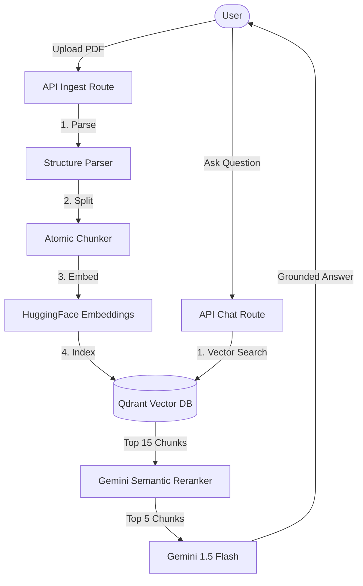

# NotebookRAG

A modern Retrieval-Augmented Generation (RAG) application inspired by Google NotebookLM. This project allows users to upload technical documents and engage in a grounded conversation where every answer is strictly backed by source evidence from the document.

## 🌟 Features

- 📄 **Advanced Document Ingestion**: Supports PDF and plain text with automated header/footer cleaning.
- 🧩 **Structure-Aware Chunking**: Specialized strategy for academic CS textbooks that preserves Theorems, Proofs, and Code Blocks.
- 🚀 **Multi-Stage Retrieval**: Two-stage retrieval pipeline using Qdrant vector search followed by Gemini-based semantic reranking.
- 💬 **Grounded Chat**: Conversational interface with strict anti-hallucination guardrails.
- 📑 **Precision Citations**: Detailed source cards showing `Section > Theorem > Page` for maximum traceability.
- 🎨 **Premium UI**: Modern, dark-mode split-panel interface designed for deep focus.

---

## 🏗️ System Architecture



---

## 🧠 Optimized Chunking Strategy

### The Problem: Naive Splitting
Standard RAG systems use fixed-size windows (e.g., 500 characters) to split text. In academic textbooks, this is problematic: a formal **Theorem** might be cut in half, or a **Proof** might lose its concluding logic, leading to incorrect retrieval and fragmented answers.

### Our Solution: Structure-Aware Atomic Chunking
This project implements a specialized strategy for CS textbooks:
1. **Structural Identification**: The parser detects spans for `Chapter`, `Section`, `Theorem`, `Lemma`, `Proof`, and `Algorithm`.
2. **Atomic Preservation**: Blocks marked as *Atomic* (like Theorems or Code Blocks) are preserved as single units whenever possible.
3. **Guarded Overflow**: If an atomic block exceeds the token limit, it is split only at sentence or paragraph boundaries to preserve semantic coherence.
4. **Recursive Refinement**: Standard paragraphs are split using a 512-token target with a 100-token overlap to maintain local context.

---

## 🛠️ Tech Stack

- **Frontend**: Next.js 14, React, Tailwind CSS
- **Orchestration**: LangChain.js
- **Vector Database**: Qdrant Cloud
- **LLM**: Google Gemini 1.5 Flash
- **Embeddings**: HuggingFace (`all-MiniLM-L6-v2`)
- **Styling**: Vanilla CSS

---

## 🚀 Getting Started

### Prerequisites
- Node.js 18+
- Gemini API Key
- Qdrant Cloud Cluster (or Local Docker)
- HuggingFace API Key

### Installation

1. **Clone & Install**
   ```bash
   git clone https://github.com/Ujjwaljain16/Basic-RAG.git
   cd Basic-RAG
   npm install
   ```

2. **Environment Setup**
   Create a `.env.local` file:
   ```env
   GOOGLE_API_KEY=your_key
   QDRANT_URL=your_url
   QDRANT_API_KEY=your_key
   HUGGINGFACE_API_KEY=your_key
   COLLECTION_NAME=notebooklm_rag_v3
   ```

3. **Run Development Server**
   ```bash
   npm run dev
   ```

---

## 📊 Evaluation & Metrics

The system is evaluated qualitatively and through retrieval-focused benchmarks focusing on:
- **Recall@K**: Ensuring the most relevant theorems and definitions appear in the top retrieval results.
- **Faithfulness**: Verifying that the LLM response is derived exclusively from the retrieved document context.
- **Citation Accuracy**: Ensuring that every claim in the chat maps correctly to the specific `Section` and `Page`.

---
**Author**: Ujjwal Jain  
**Project**: NotebookRAG (Basic-RAG)