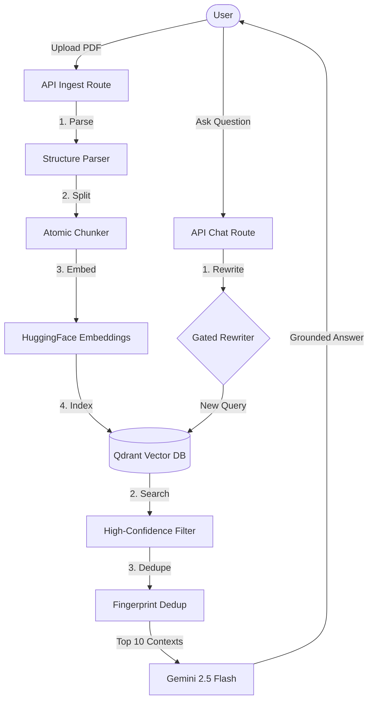

# NotebookRAG

A production-hardened Retrieval-Augmented Generation (RAG) application optimized for speed and accuracy within free-tier constraints. Inspired by Google NotebookLM, this project transforms academic textbooks into interactive, grounded knowledge bases.

## 🌟 Features

- 📄 **Structural Document Ingestion**: Advanced PDF parsing that strips headers/footers and identifies structural blocks (Chapters, Sections, Theorems).
- 🧩 **Atomic Chunking**: Specialized strategy for textbooks that preserves semantic units like Proofs and Algorithms without splitting them mid-logic.
- ⚡ **High-Performance Retrieval**: Replaced heavyweight LLM reranking with a low-latency pipeline (Top-40 Dense Search + Score-based Hygiene) for near-instant responses.
- 🧠 **Conversational Intelligence**: Gated query rewriting transforms follow-up questions into standalone technical queries only when necessary, saving API quota.
- 🛡️ **Production Resilience**: Robust 503 error handling for Gemini rate limits and automated deduplication of identical document chunks.
- 🎨 **Premium UI**: Modern, dark-mode interface with smooth animations and responsive side-panels.

---

## 🏗️ System Architecture



---

## 🧠 Production Optimizations

### 1. Latency-First Retrieval
Heavyweight reranking (which cost ~10s per query) has been replaced with a **Candidate Hygiene** layer. We retrieve a larger candidate pool (Top 40) and apply strict rule-based filtering (confidence > 0.2, length > 150 chars) to eliminate noise like Table of Contents entries.

### 2. Gated Query Rewriting
To handle conversational context (like "Explain it more") without wasting API credits, the system uses a heuristic gate. It only triggers the LLM-based query rewriter if pronouns or short queries are detected, otherwise passing the original query directly to vector search.

### 3. Context Deduplication
Duplicate chunks from multiple uploads are eliminated at runtime using a text fingerprinting mechanism (hashing the first 100 characters), ensuring the LLM context window is used exclusively for unique evidence.

---

## 🛠️ Tech Stack

- **Frontend**: Next.js 14 (App Router), React
- **Orchestration**: LangChain.js
- **Vector Database**: Qdrant Cloud (with Payload Indexing)
- **LLM**: Google Gemini 2.5 Flash
- **Embeddings**: HuggingFace Inference API (`all-MiniLM-L6-v2`)
- **Styling**: Vanilla CSS (Global Variables & Modern Layouts)

---
## Screenshots


---


## 🚀 Getting Started

### Prerequisites
- Node.js 18+
- [Google Gemini API Key](https://aistudio.google.com/)
- [Qdrant Cloud API Key & URL](https://cloud.qdrant.io/)
- [HuggingFace API Key](https://huggingface.co/settings/tokens)

### Installation

1. **Clone & Install**
   ```bash
   git clone https://github.com/Ujjwaljain16/Basic-RAG.git
   cd Basic-RAG
   npm install
   ```

2. **Environment Setup**
   Create a `.env.local` file:
   ```env
   GOOGLE_API_KEY=your_key
   QDRANT_URL=your_url
   QDRANT_API_KEY=your_key
   COLLECTION_NAME=notebooklm_rag_prod
   HUGGINGFACE_API_KEY=your_key
   ```

3. **Run Development Server**
   ```bash
   npm run dev
   ```

---

**Author**: Ujjwal Jain  
**Project**: NotebookRAG (Basic-RAG)
